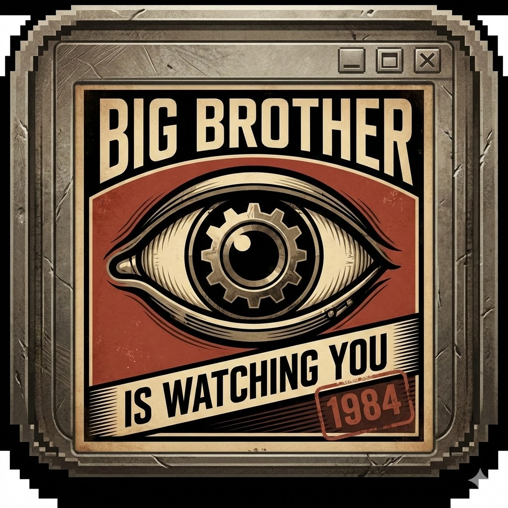

# Monitoring Software for High School Educational Purposes

---

## Základní údaje

- __Autor díla:__ Bc. Lukáš Horák
- __Rok práce:__ 2026

> Jedná se o open-source projekt spadající pod MIT licenci.

Tento projekt slouží pro monitoring studentů na střední průmyslové škole. Tento software má za účel předejít podvodům během testů, které jsou zaměřeny na programování. Projekt je v tuto chvíli ve fázi vývoje a všechny následující updaty zde budou zveřejňovány.